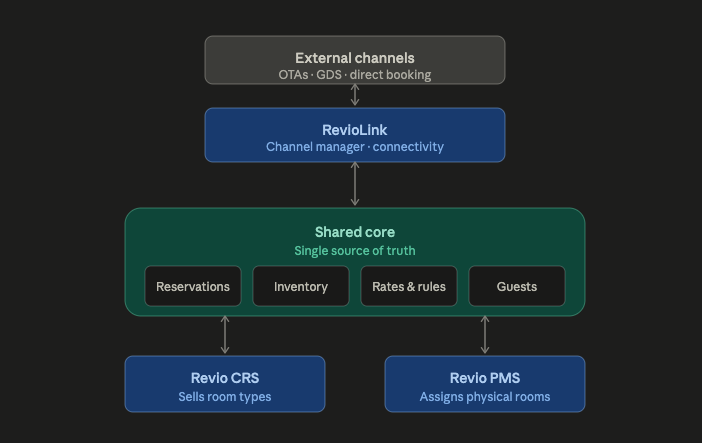

# Hierarchy — How Revio's Products Relate to Each Other

> Founder spec, received 2026-07-09. Source: "Master Platform Hyerarcy.docx".
> Diagram: [assets/hierarchy-diagram.png](assets/hierarchy-diagram.png)

This page explains the structural decision behind the Revio suite: why the CRS is a central peer above the properties rather than a module inside the PMS, and the one rule that keeps the whole architecture sound. Read this before working on anything that touches reservations, availability, or the boundary between products.

## 1. The three products, one line each

- **RevioLink** — the channel manager. Pure connectivity and translation between the Revio core and the OTAs (via Channex). Talks to the core through an API only; holds no business truth of its own. *(See the standalone-vs-integrated addendum in §6 — in standalone mode RevioLink does own the commercial definitions.)*
- **Revio CRS** — the commercial brain. Owns what is for sale: room types, rate plans, restrictions, promotions, availability, the booking engine, and the reservation at origination.
- **Revio PMS** — the operational system for the physical property: front desk, physical room assignment, housekeeping, maintenance, folios, check-in/out.

The CRS and PMS share one database — the shared core. RevioLink sits outside it, connected by API.

## 2. Why the CRS is NOT part of the PMS

It might seem natural to fold the CRS into the PMS — one app, fewer moving parts. The reason we don't comes from who Revio serves: independent hotels and small chains, with the same codebase.

The two halves of the business have different natural scopes:

- **Distribution is inherently central.** In a 5-hotel group, there is one commercial operation: one team setting rates, one pool of rate plans and promotions, one booking engine, one connection to the channel manager. One CRS instance sells for all five hotels.
- **Operations are inherently per-property.** Each hotel runs its own front desk, its own housekeeping board, its own maintenance queue. The PMS's world is one building.

Now consider what happens if the CRS lives inside the PMS. The PMS is a single-property system by nature — so the "central" commercial layer would be trapped inside a per-property box. To serve a chain you would have to bolt a multi-property concept onto a single-property system: five PMS instances each carrying a fragment of the commercial brain, plus some synchronization scheme to make them agree on rates, availability, and promotions. That synchronization layer is exactly the swamp the whole architecture is designed to avoid.

Keep the CRS above the properties instead — a central peer, not a sub-module — and both segments work with zero special-casing:

- **A small chain:** one CRS, five properties, five PMS views. Central rate strategy and distribution; per-hotel operations. This is the structure chain operators actually want and most mid-market systems do badly.
- **An independent hotel:** the same structure with the property count set to one. Nothing collapses, nothing is special-cased — the model degrades gracefully. The independent hotelier never notices the chain machinery; it simply has one entry in it.

This is also why the shared core must be property-scoped from day one: every reservation, room type, rate, and availability record carries its property. Retrofitting property scope onto a single-property schema later is one of the most painful migrations in this category of software.

## 3. The layering



```
External channels (OTAs · GDS · direct)
        ↕
RevioLink — channel manager / connectivity     ← API boundary: RevioLink never
        ↕                                        touches the core DB directly
SHARED CORE — reservations · inventory · rates & rules · guests
(single source of truth, property-scoped)
        ↕                          ↕
Revio CRS                    Revio PMS
central, one per hotel       per-property view —
group — sells room TYPES     assigns physical ROOMS
```

Two different kinds of "separate," and the distinction matters:

- **RevioLink earns independence.** It is pure transport and mapping; it could front a third-party CRS someday, or be swapped out. So it stays outside the core, behind an API.
- **The CRS and PMS earn shared data.** They are two views of the same stay — commercial and operational. So they share the core directly.

Conflating these two is how teams go wrong: either RevioLink gets welded into the core (losing its swappability), or the PMS gets pushed out of the core (creating the sync problem below).

## 4. The one rule that saves the architecture

**Never build a reservation sync between the CRS and PMS.**

A reservation is one record with two phases, not two records:

- **Commercial phase (CRS writes it):** guest, dates, room type, rate plan, price, payment terms. This is the reservation at origination — whether it came from an OTA through RevioLink, from the booking engine, or was entered manually.
- **Operational phase (PMS extends it):** physical room assigned, checked in, folio charges, housekeeping state, checked out. Same record, more fields populated as the stay progresses.

The division of inventory follows the same line and resolves most apparent overlap between the products:

**The CRS sells room types. The PMS assigns physical rooms.**

The CRS controls sellable room-type inventory (and may deliberately oversell as a commercial decision); the PMS deals with physical-room reality and flags when committed reservations exceed real rooms.

### Write ownership

Shared database does not mean everything writes everywhere. Each side owns its fields:

| Field group | Owner (writes) | Others |
| --- | --- | --- |
| Rates, restrictions, availability, promotions | CRS | read-only |
| Reservation commercial fields (dates, room type, rate, price, guest, payment terms) | CRS | read-only |
| Physical room assignment, check-in/out state, housekeeping, maintenance, folio | PMS | read-only |
| Channel mappings, sync state, credentials | RevioLink (its own store) | — |

Either product may read the other's fields freely. Neither writes across the line. When a bug looks like "the PMS changed a rate and distribution went weird," it is almost always a write-ownership violation.

### The smell test

If a developer ever finds themselves writing code described as "push the reservation from the CRS to the PMS" (or the reverse), stop. That sentence means something has been split that should never have been split — two records now exist where one should, and a reconciliation layer is being born. Reconciling CRS↔PMS reservation state is the single most expensive, bug-prone, never-finished component in this industry's legacy systems. The shared core exists precisely so that this component never has to be written.

The correct mental model for any cross-product flow is always: one side writes its fields on the shared record; the other side reads them. Events may notify ("a reservation was confirmed", "availability changed") — but events carry pointers to the record, never copies of it.

## 5. Quick reference

- One reservation record, two phases: CRS originates (commercial), PMS extends (operational).
- CRS sells room types; PMS assigns physical rooms.
- CRS is central per hotel group; PMS is per property; the core is property-scoped from day one.
- CRS + PMS share the core database with strict write ownership; RevioLink connects by API only.
- An independent hotel is a chain of one — same architecture, property count = 1.
- If it sounds like "sync reservations between CRS and PMS," it's wrong.

## 6. Addendum — standalone vs integrated (supersedes "no business truth")

*(Added per the RevioCRS guide §1.2, which flags that the "RevioLink holds no business truth" line above is superseded.)*

RevioLink can run **without** the CRS. Some properties buy RevioLink alone to control their OTA extranets, with booking notifications delivered by email. This gives two deployment modes:

- **Standalone (RevioLink only):** RevioLink owns the commercial definitions, and channel bookings terminate in RevioLink (stored there and/or emailed to the property). There is no CRS reservation record.
- **Integrated (RevioLink + CRS):** the CRS is an optional layer on top. Both products read and write the **same shared core**. The CRS owns the canonical reservation; RevioLink becomes the channel-monitoring view.

Commercially this is a ladder: sell RevioLink alone, upsell the CRS when the property wants central reservations.

**The one-record rule for products:** because room types and rate plans are authored in *both* products, there is one room-type record and one rate-plan record in the shared core. RevioLink and the CRS are **two edit surfaces onto the same record — never two tables that sync.** In standalone mode RevioLink is the sole author; when the CRS joins, it edits the *same* records.

**Implementation note (Revio monorepo):** the "API boundary" is realized today as the module boundary — `@revio/core` + `@revio/connectivity` inside the modular monolith, with RevioLink's own store being its channel/mapping/credential tables. The boundary is enforced as write-ownership discipline and remains extractable to a standalone service later (see `ARCHITECTURE.md`).
