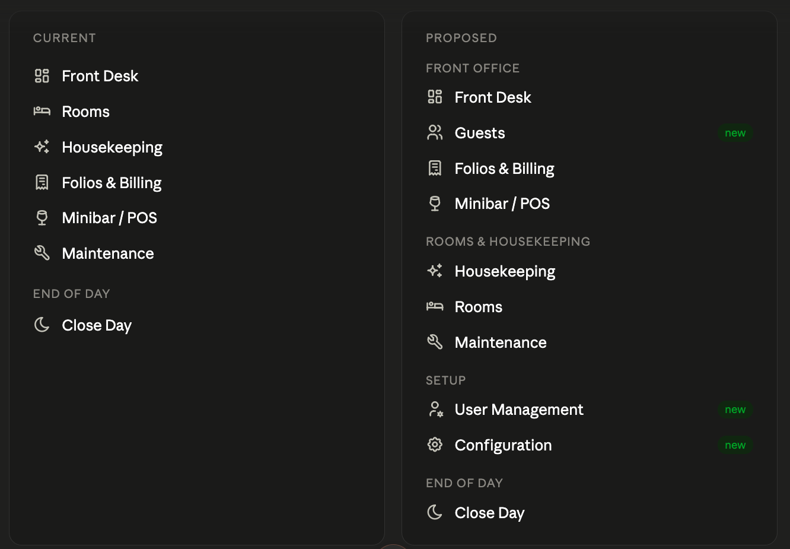

# RevioPMS — Interface, Navigation & Feature Guide (v1)

> Founder spec, received 2026-07-09. Source: "RevioPMS dev.docx".
> Nav screenshot: [assets/pms-nav-proposed.png](assets/pms-nav-proposed.png)

A working spec for the RevioPMS product, written to be read top to bottom by a developer new to hotel operations. Domain terms are explained inline and collected in a glossary at the end.

RevioPMS is already a complete, credible v1: all five operational pillars are present (front desk, rooms, housekeeping, folios, POS, maintenance) plus a working night audit. The boundaries the other two products depend on all landed correctly here. Most of this guide adds capability and pushes specific screens toward state-of-the-art. As in the RevioLink and CRS guides, each screen is split into Keep (correct, must survive any refactor) and Change (specific edits). Treat "Keep" as binding.

## 1. Orientation for the developer

### 1.1 What the PMS is

RevioPMS is the operational system — the tool the property runs on daily. It owns the physical and operational reality of the hotel: which physical room a guest is in, whether that room is clean, what the guest owes, what maintenance is open, and the end-of-day close. Where the CRS is the commercial brain (what's for sale, the reservation at origination) and RevioLink is the connectivity layer (channels), the PMS is where the stay actually happens.

### 1.2 The shared-core reservation — one record, two phases

A reservation is one record in the shared core. The CRS writes its commercial fields at origination (source, rate plan, price, dates, guest). The PMS extends the same record operationally (assigns a physical room, checks the guest in, attaches a folio, records checkout). It is never a synced copy. Arrivals on the Front Desk come straight from that shared record (RevioCRS / channels). If a developer ever builds a "PMS reservations" table that syncs against a "CRS reservations" table, that is the failure mode — one record, two phases.

### 1.3 Physical rooms vs room types

The CRS sells room types (Deluxe Double, Studio Apartment). The PMS assigns physical rooms (110, 404). This division is where much of the PMS's logic lives — assignment, housekeeping, maintenance all operate on physical rooms, while availability and rates operate on types. The Rooms screen states this correctly: "48 physical rooms across 6 room types."

### 1.4 The boundaries — what belongs here, and what leaves

Operational facts (housekeeping, maintenance, walk-ins, physical assignment, POS consumption) are owned by the PMS and only the PMS. Two rules govern how they interact with the rest of the suite:

- When an operational fact changes availability — a room goes out of order, a walk-in consumes a room — the PMS emits the availability effect to the shared core, which the CRS and RevioLink surface as reduced availability. The PMS never pushes the operational cause onto a distribution screen. "Bad smell in room 406" is a maintenance task here; the channels only ever see "one fewer room available."

- The city tax the CRS defined is applied here as a folio charge (see §4.6). The CRS defines the rule, the PMS posts the money, the channel manager discloses it to the OTA.

The current build gets this right: OOO flags "take the room off sale on every channel," and the "bad smell" task correctly lives in Maintenance rather than leaking into a sync log. Protect that.

### 1.5 The design principle: configure to the property, don't impose a model

A 12-room guesthouse and a 200-room hotel run assignment and housekeeping completely differently. The PMS must build the machinery and gate it with a per-property toggle, defaulting to the simpler mode, rather than forcing one operating model. This applies to auto-assignment (§4.1), the housekeeping inspection gate (§3.4), and the deposit held/applied behaviour (§4.4). When in doubt, build the capability and let the property switch it on.

### 1.6 Three integration boundaries

The PMS has three specialist, compliance-heavy boundaries it must talk through rather than reimplement — the same shape as Channex for distribution:

- Payment gateway (Stripe / Adyen / a regional gateway) for any real card, virtual-card, or card-deposit transaction. The PMS stores a token and the transaction result, never a card number (§4.5).

- External POS systems (a restaurant/bar system a property already owns), connected later through the charge-posting service (§4.2). Native outlets are built now; external connectors are built when a real property needs one.

- Fiscalization / e-invoicing compliance (§4.7) — the certified path by which invoices and receipts are reported to a tax authority. This is per-country and legally mandatory in many markets; the PMS talks to it through a boundary and never reimplements a country's tax-authority protocol.

### 1.7 The charge-posting service — read this before building POS

This is the most important architectural instruction in the guide. Every charge that lands on a folio — room, city tax, minibar, spa, bar, restaurant, extras — must go through one internal charge-posting service, not be written directly to the folio by each screen.

- Do: build native POS/outlet screens (and the folio's "post a charge") as callers of a single posting service. The service tags every charge with its outlet (Room, Minibar, Spa, Bar, Restaurant) and its tax category, then writes it to the folio.

- Don't: let the Minibar screen, the folio, or a future spa screen write folio lines directly. Direct-write POS is the trap: when an external restaurant POS needs to connect later, it has nowhere clean to plug in, and you retrofit under pressure.

The payoff is large and cheap now: native outlets call the service; an external POS later calls the same service through an API and becomes just another outlet; and the outlet tag is exactly what the invoice needs to break out "Spa — massage" from "Accommodation" (§4.3). Building this now is a small amount of forethought. Retrofitting it later is the expensive path. Build native POS the extensible way.

## 2. Navigation

The current list is a flat set plus an End-of-Day group. Light grouping aligns it to the roles that use each area (reception vs housekeeping vs admin) and makes room for the new tabs.

Before

- Front Desk

- Rooms

- Housekeeping

- Folios & Billing

- Minibar / POS

- Maintenance

- — END OF DAY —

Close Day

After

- — FRONT OFFICE —

- Front Desk

- Guests                 (new — operational guest profile)

- Folios & Billing

- Minibar / POS          (extends into multi-outlet posting)

- — ROOMS & HOUSEKEEPING —

- Housekeeping

- Rooms

- Maintenance

- — SETUP —

- User Management        (new — scoped view onto the shared identity)

- Configuration          (new — taxes/VAT, invoice series, deposit types, outlets)

- — END OF DAY —

Close Day

The grouping mirrors the access model: a Reception role lives in Front Office, a Housekeeper role sees only the relevant Rooms & Housekeeping screens (mobile), and Setup is Manager/Admin only. The unified Reservation view (§3.2) is not a nav item — it opens from Front Desk rows.

## 3. Screen-by-screen

### 3.1 Front Desk

Purpose: the operational home screen — today's arrivals, in-house guests, room-status summary, walk-in.

Keep

- The day-view shape (Arrivals to check in · In house · status cards · Walk-in) and the property/business-date header. This is the screen reception lives in.

- The behaviour note: arrivals come from the shared reservation record; check-in assigns a physical room and marks it occupied; check-out sets the room dirty.

Change

- Add a "Departures — due out today" list alongside Arrivals and In house. Today due-outs are only reachable as checkout buttons inside the in-house list; reception needs the explicit list.

- Flag assignment conflicts. The current data shows two guests both in room 110 — whether demo noise or a real double-assignment, the Front Desk must warn on conflicting assignments and on arrivals with no room assigned.

- Show room-ready status on each arrival — is the assigned room clean/inspected yet? This is the single most-used fact at a front desk (can I check them in now, or am I waiting on housekeeping?).

- Each arrival / in-house row opens the unified Reservation view (§3.2); the folio and move icons remain as quick actions.

### 3.2 Reservation view (new screen)

Purpose: open a reservation and see both its commercial origin and its operational state in one place. This is the highest-value new screen — it makes the shared-core architecture visible and is a genuine market differentiator.

Build three zones:

- Commercial zone (read-only, from the CRS): source/channel, rate plan, price, payment terms, cancellation policy. Written at origination; the PMS displays but does not edit it.

- Operational zone (PMS-writable): assigned physical room, check-in/out state, folio link, housekeeping status of the room, deposits.

- Timeline: booking received → room assigned → checked in → moved (with reason) → charges posted → checked out. The "history of the stay" view that almost no PMS does well.

### 3.3 Guests (new screen)

Purpose: the operational guest profile — the richer view the CRS deliberately is not (the CRS Guests screen is a thin "not a CRM" list). This belongs in the PMS because the folio and POS history it is built from live here.

Contents (all derived from operational history): prior stays, lifetime nights, average nightly spend, average ancillary/POS spend, favourite items (from consumption), preferred room/floor, complaint/issue history.

The point is surfacing at the moment of action, not a tab that sits unread: at check-in ("bought a late checkout on 3 of 4 stays — offer it"), at assignment (give them their usual floor). Reachable from Front Desk and the folio as well as the tab.

### 3.4 Housekeeping

Purpose: the housekeeping board — per-room status, tap to update, filterable. This is where most of the "smart" ambition lands.

Keep

- The board, the status filter chips, the floor grouping as a layout, and the occupied-room guest name. Tap-to-update is the right interaction.

Change

- Smart routing. Replace pure floor order with a recommended cleaning order: same-day arrivals first (early check-ins ahead of the rest) → VIP / known-preference rooms → room-move targets → stayovers → departures-without-an-arrival last. Show the reason on each room ("arrival 1pm", "VIP", "move-in 3pm"). The reason-transparency is what makes staff trust the order instead of ignoring it.

- Add a "Cleaning / in progress" state to the status set (currently Clean / Dirty / Inspected / Out of order). A room mid-clean must be visible to reception and the supervisor.

- The one-room-in-progress rule (important, real-world constraint). A housekeeper may have only one room in "in progress" at a time — because in reality they clean one room at a time, and allowing several lets statuses be gamed and blinds the supervisor. The only exception is connecting rooms, which may be in progress together because they are physically one job. Enforcement details:

- Attempting to start a second, non-connected room blocks with a message ("Finish or release 204 before starting 210") rather than silently allowing it — the block is what enforces the discipline.

- This rule binds the housekeeper role only. A supervisor or admin on the desktop board is not cleaning and may set any status without the constraint.

- The rule depends on the connecting-room attribute existing on rooms (§3.5) — so that attribute is a data requirement, not a nice-to-have.

- Per-room housekeeper assignment — assign rooms to staff; each cleaner sees their own list.

- Configurable inspection gate (per-property toggle). On: Cleaned → Inspect-pending → supervisor approves → Clean; nothing is sellable until inspected. Off: Cleaned counts as Clean, no supervisor step. Build the inspect state in the machine either way — the toggle only decides whether a room auto-advances through it. That way a property can turn inspection on later (or seasonally) without reworking the status model.

- Mobile housekeeping role. A limited-access mobile view (housekeeping screens only, nothing else of the PMS), real-time status flowing to reception, with the optional supervisor inspection layer. Not a separate app — a scoped mobile view driven by the Housekeeper / Housekeeping Supervisor roles (§3.9).

- Report-an-issue from housekeeping — when a cleaner finds damage or a fault, they flag it (optionally with a photo, §3.8), which creates or links a Maintenance task.

### 3.5 Rooms

Purpose: the physical-room inventory — create/delete rooms, see live status, grouped by room type. Setup is touched rarely; the status view overlaps housekeeping.

Keep

- The type-grouped layout, physical counts per type, and the "physical rooms across room types" framing.

Change

- Deletion guard — a room that is occupied, assigned, or has future reservations cannot be deleted; warn rather than fail.

- Per-room attributes for assignment and rules: floor, connecting-room links (required by the one-room-in-progress rule and by family/group assignment), and features (quiet, accessible, view, smoking). Assignment logic and guest preferences need this data to exist.

### 3.6 Folios & Billing (and the Invoicing module)

Purpose: the guest's bill — post charges, take payments, handle deposits, check out, and issue invoices. This is the most-expanded area in this pass.

Keep

- The folio structure (bill lines → charges / payments / balance), the per-charge and per-payment posting, the payment methods (Cash / Card / Company account / Bank transfer), and the checkout-with-logged-override.

- The city tax posting as a folio Fee line — this is the CRS "payable on spot" flow landing correctly. Keep it.

- The "label + amount only — no card number stored" principle. The payment gateway (§4.5) preserves this, it doesn't break it.

Change — folios

- Split folios & charge routing. A reservation can carry more than one folio, and individual charge lines can be moved between folios. This one mechanism delivers every split you need: room → company folio and extras → guest folio (two invoices); a 50/50 split between two guests; a separate accommodation invoice and consumption invoice (route accommodation lines to one folio, consumption to the other). The existing "bill to company" override hints at this — make it real.

- Deposits — see §4.4. Deposits appear on the folio as their own capture / use / refund entries so the bill tells the whole story.

- City-tax suppression — when the CRS marks the tax "included", the PMS must not post the folio Fee line (the two modes from the CRS spec must both be honoured here).

Change — invoicing module (new, high priority)

Charges live on folios; invoices are generated from folios. That separation is the architecture — an invoice is "render this folio (or these selected lines) as a numbered tax document." The module is built jurisdiction-agnostic: universal invoice primitives in the core, and everything that varies by country expressed as configuration (a per-jurisdiction "compliance pack"), never hardcoded to one market. The universal primitives — required almost everywhere for a compliant tax invoice — are:

- A sequential invoice number series with no gaps — with separate series for invoices, proformas, and credit notes.

- Issuer legal identity + tax/VAT ID; buyer details including buyer tax/VAT ID for company invoices.

- Date of taxable supply distinct from the issue date.

- A tax summary broken down by rate. Accommodation typically sits at a different (often reduced) rate than F&B or other services, so each charge type carries its own tax rate (§4.6) and the invoice shows net / tax / gross per rate, with accommodation as its own line.

- Invoice types: accommodation invoice, consumption invoice, or a combined one — all just "which folio / which lines."

What varies by country becomes configuration, not code: the tax rate values and how many rates exist, what counts as the taxable-supply date, invoice field labels and language, currency, rounding rules, and whether the market requires fiscalization or structured e-invoicing (§4.7). Build the primitives once; let a jurisdiction pack switch on the local specifics. This is multimarket from day one with the ability to adapt per market — see §4.7 for the first-market (Bulgaria / EU) picture and the compliance boundary.

Stay extras (recurring charges). "Add breakfast for the whole stay" is different from a one-off. It is a per-night recurring extra that posts automatically at each night audit and appears as its own line — so build a small "stay extras" concept (breakfast, parking, half-board) that accrues nightly, separate from one-off POS. Boundary note: adding breakfast operationally here does not change the CRS rate plan the guest booked; it adds folio charges. The rate plan stays as sold; the folio reflects reality.

### 3.7 Minibar / POS → Outlets

Purpose: post consumption to a guest's folio from a catalog. Extends into multi-outlet posting.

Keep

- The pick-a-room → catalog → tap-to-add flow, the Manage catalog action, and the item/extras split. Clean and fast.

Change

- Generalise to outlets. Minibar becomes one outlet among several (Spa, Bar, Restaurant), each a tagged charge source with its own catalog. "Charge to room" from an outlet is: staff look up an in-house guest and post to their folio.

- All posting goes through the charge-posting service (§1.7 / §4.2) with the outlet tag — native outlets now, external POS connectors later against the same service.

- Feed consumption into the guest profile (§3.3) for favourite-item upsell — no structural change, just capture the history.

- Outlet/POS role (§3.9): a bartender can look up an in-house guest and post to their folio and see nothing else of the PMS.

### 3.8 Maintenance

Purpose: log repairs and faults; flag a room out of order to take it off sale.

Keep

- The task model (what's wrong · room · priority · assignee · out-of-order), and the OOO→distribution behaviour ("off sale on every channel until done"). This is the correct write-side of the OOO flow the CRS and RevioLink only read.

- Faults living here, not in any distribution log ("bad smell in room" belongs here).

Change

- Attach a photo to a task / reported issue. A generic room photo gallery isn't the useful thing — a photo attached to an issue is. It serves three needs at once: maintenance (show the technician the fault), housekeeping exception reporting (a cleaner photographs damage when flagging it), and damage-deposit evidence (§4.4). Reachable from Maintenance and from the housekeeping report-an-issue action. Routine cleaning needs no photos; exceptions and faults do.

- Room lifecycle timeline — a per-room history (cleaned → issue reported → OOO → repaired → back in service) assembled from housekeeping + maintenance + moves. The industry-gap feature; pairs with the reservation timeline (§3.2).

- Recurring / preventive tasks (scheduled inspections) — flag for a later phase; not now.

### 3.9 User Management (new)

Purpose: manage who can log in and what they can touch — as a scoped view onto the shared identity, not a standalone user system.

- One identity per person across every Revio product; the account is the shared-core identity. This tab lets a manager invite a person, assign a role, and deactivate them for this property without leaving the PMS, but does not create a separate PMS-only account.

- Roles: Owner/Admin, Manager, Reception, Housekeeper, Housekeeping Supervisor, Maintenance, Outlet/POS staff. The Housekeeper role is the scoped mobile view (§3.4); the Outlet/POS role is the outlet-only posting view (§3.7).

### 3.10 Configuration (new)

Purpose: the property-level setup the new modules need. The PMS currently has no config area; these need a home.

- Taxes / VAT: VAT rate per charge category (accommodation reduced rate, F&B, other services) and the city-tax setup, mapped to charge types. Shared with the CRS's Taxes & Fees — the property's core tax setup is one source of truth read by both products; only the invoicing-specific detail (VAT rate per charge category, numbering series) lives in the PMS. This prevents two tax tables drifting apart.

- Invoice series (numbering for invoices / proformas / credit notes).

- Jurisdiction / compliance pack (§4.7) — the per-country selection that drives tax rates, invoice labels/language, currency and rounding, and whether fiscalization and/or structured e-invoicing are active for this property. This is what makes the invoicing core multimarket without code changes.

- Deposit types (Consumption, Damage, property-defined) with their held/applied behaviour and VAT-at-capture-or-use setting (§4.4).

- Outlets (Minibar, Spa, Bar, Restaurant) and their catalogs.

### 3.11 Close Day (night audit)

Purpose: the end-of-day close — roll the business date, handle no-shows, surface anything outstanding.

Keep

- The whole flow: current business date, un-arrived → no-shows, "before you close" (overdue checkouts + open balances with quick links), and the explicit "closing will mark N no-shows and roll the date" confirmation. This is a real night audit and its presence is what makes the PMS credible.

Change

- Confirm the close posts the night's room + tax charges — revenue should accrue nightly at the audit, not only at checkout — and posts any recurring stay extras (§3.6).

- Produce a close / audit report for the record (occupancy, revenue, no-shows, arrivals/departures for the day).

## 4. Cross-cutting features

### 4.1 Room assignment

Assign the room type at booking (the CRS did that); assign the physical room late — the night before arrival or at check-in — never at booking time, because early physical assignment causes constant reshuffling as new bookings land.

- Auto-assignment: opt-in per property, off by default. It's only as good as the arrival data and housekeeping discipline behind it, so a property switches it on when ready. When on: runs the evening before (and on demand), assigns physical rooms late, and pins manual overrides so a later run never reshuffles them.

- "Suggest a room" even when auto-assign is off — proposes without committing, giving cautious properties the benefit without losing control.

- Optimise to keep contiguous availability open (avoid stranding single nights — fragmentation) and honour known preferences (floor, quiet, connecting).

- Group bookings: a pre-pass that reserves a contiguous block (same floor / adjacent, connecting rooms for families) before individual auto-assignment runs, so a group never scatters across floors.

- Mid-stay move: split the folio by nights across rooms (nights 1–2 room A, 3–5 room B, charges following the guest), keep it one reservation, reason-code the move (maintenance / upgrade / request / noise), free the vacated room's remaining nights, block the new one, and log it to the timeline. (Confirm what today's move icon already does, to know whether this is an extension or a build.)

### 4.2 The charge-posting service

Restated here because it governs several screens: every charge goes through one internal posting service that tags outlet + tax category and writes to the folio. Native POS/outlet screens and the folio's "post a charge" are callers. An external POS connects later to the same service. Never let a screen write folio lines directly. See §1.7 for the full do/don't.

### 4.3 Invoicing

Built on folios generate invoices (§3.6). Splitting = multiple folios + move-line-between-folios. Outlet + tax-category tags (from the posting service) are what let the invoice break out accommodation vs spa vs F&B and summarise tax per rate. Sequential gapless numbering, taxable-supply date, and buyer tax/VAT ID are the universal must-haves; market-specific rules (rates, labels, fiscalization, e-invoice format) come from the jurisdiction pack (§3.6, §4.7), never hardcoded.

### 4.4 Deposits

The accounting principle first, because the books break without it: a deposit is not revenue when taken. It is money held that may be returned — a liability — until it is applied to charges or refunded. If the system ever books a deposit as revenue or as an ordinary payment against charges, both the night-audit revenue and the folio balance go wrong.

Two behaviours, which are the property's toggle — settable per deposit type as well as per property:

- Held (default, and the one you confirmed). The deposit sits in its own folio section, separate from the running balance. Charges accrue normally and the balance grows. At checkout the guest either pays the balance another way and you refund the deposit, or presses Use deposit to apply it to the balance and settle the remainder (or take change). This is the "guest settles at reception on checkout" model. Damage deposits are almost always Held.

- Applied. The deposit is recorded as a payment immediately; it shows under Payments and the balance drops as charges accrue, possibly into credit (refunded at checkout). The consumption-prepayment model.

So the "decreases or not" toggle is really "is this deposit held or applied." Support:

- Deposit types (Consumption, Damage, property-defined), each carrying its held/applied behaviour and its own reporting.

- Capture (cash = drawer entry; card / virtual card = gateway transaction against a token, §4.5), Use deposit, and Refund — all shown on the folio as their own entries.

- VAT timing per deposit type: a held deposit isn't a taxable supply until applied; an applied prepayment for a known service can trigger the VAT point at capture in the EU. So the invoicing module must know, per deposit type, whether VAT applies at capture or at use — a property-accountant setting in Configuration, never hardcoded.

### 4.5 Payment gateway

Any real card, virtual-card, or card-deposit transaction flows through a payment gateway (Stripe / Adyen / a regional gateway) — the same boundary logic as Channex for distribution. This preserves the "no card number stored" principle: the gateway tokenises the card, the PMS stores only a token and the transaction result, and PCI scope stays with the gateway. Cash deposits are drawer entries; card and VCC deposits are gateway transactions against the token; refunds go back through the same gateway (or the drawer for cash).

Two domain notes: virtual cards (VCCs) are usually an OTA mechanism — Booking.com and others issue a VCC for the booking amount, often activatable only on a set date — so a VCC is typically a prepayment of the booking, not a guest security deposit; same charging mechanism, but model it as OTA-originated prepayment. And VAT timing on deposits (§4.4) interacts with capture, so the two features are built aware of each other.

### 4.6 City tax and VAT

- City tax: the CRS defines the rule; the PMS applies it as a folio Fee line (payable-on-spot) or suppresses it (included). Never changes the rate exported to the channel. Already landing correctly — keep it, add the suppression case.

- VAT: configured per charge category at the property (§3.10), shared with the CRS's tax setup as one source of truth, applied on the folio and summarised per rate on the invoice, with accommodation broken out.

### 4.7 Fiscalization & e-invoicing compliance (the third integration boundary)

Tax-authority compliance is per-country, legally mandatory, and changing fast across the EU. The PMS must not reimplement any country's tax-authority protocol — it talks to a compliance boundary (a certified provider such as those offering fiscalization/e-invoicing APIs) driven by the jurisdiction pack (§3.6). Build the seam once; add country packs as you enter markets. There are two distinct things a market may require, and they are not the same:

- Fiscalization — consumer-facing sales (receipts) must be reported to the tax authority in real time through a certified fiscal device or certified POS software, which returns a unique fiscal number/seal that must appear on the receipt. This is a receipt/POS-side obligation and it touches the folio, POS, and payment flows directly.

- Structured e-invoicing / digital reporting — B2B/company invoices must be issued in a structured electronic format (e.g. EN 16931 via Peppol or a national platform) and/or reported to the authority. This is an invoice-side obligation.

First markets — Bulgaria and the EU (as of mid-2026, verify at build time as dates move):

- Bulgaria (launch market) — fiscalization is the live, immediate requirement. Under Ordinance N-18, VAT-registered businesses must transmit consumer sales (cash, card, transfer) to the National Revenue Agency (NRA) in real time via a certified fiscal device or SUPTO-certified POS software, which stamps each receipt with a fiscal number/seal. This is enforced today, so a Bulgarian property cannot go live without the PMS posting sales through a certified fiscal path — treat it as a launch blocker, integrated via the compliance boundary, not built in-house. Separately, SAF-T monthly reporting began January 2026 (large enterprises first, phased to almost all by 2030) — an accounting export, so keep the data model SAF-T-exportable. B2B e-invoicing in Bulgaria is currently voluntary (public bodies must be able to receive EN-16931 invoices), so structured e-invoicing there is a design-for, not a blocker. Note Bulgaria adopted the euro in January 2026, so EUR as the folio currency is already correct.

- EU generally — structured e-invoicing is mostly future, but design the seam now. ViDA mandates cross-border B2B e-invoicing and digital reporting from 1 July 2030 on the EN 16931 standard, but several member states have earlier domestic mandates (Belgium Jan 2026, Poland Feb 2026, Greece Mar 2026, France Sept 2026, Germany phased 2027–28). Because entry dates differ per country, the compliance pack must be switchable per property, and the invoice data model should already carry EN-16931-style fields (buyer tax ID, IBAN, taxable-supply date, corrective-invoice sequencing) so turning a market on is configuration, not a rebuild.

The rule for the developer: fiscalization/e-invoicing is a boundary, like the payment gateway. Route through a certified provider, gate it by jurisdiction pack, and keep the invoice/receipt core generic. Building this seam now is cheap; retrofitting a real-time fiscal-device requirement into a direct-print receipt flow later is not.

## 5. Change log — v1

- Navigation grouped into Front Office / Rooms & Housekeeping / Setup / End of Day (§2).

- Front Desk: departures-due-today list; assignment-conflict flags; room-ready status on arrivals; rows open the reservation view (§3.1).

- New unified Reservation view — commercial zone + operational zone + timeline (§3.2).

- New Guests screen — operational guest profile, surfaced at check-in/assignment (§3.3).

- Housekeeping: smart routing with reasons; "in progress" state; one-room-in-progress rule with connecting-room exception; per-room housekeeper assignment; configurable inspection gate; mobile housekeeping role; report-an-issue (§3.4).

- Rooms: deletion guard; per-room attributes incl. connecting-room links (§3.5).

- Folios: split folios & charge routing; deposits; city-tax suppression when "included" (§3.6).

- New Invoicing module — jurisdiction-agnostic; folios generate invoices; sequential numbering; tax-per-rate with accommodation broken out; stay extras / recurring breakfast (§3.6, §4.3).

- Minibar/POS → Outlets — multi-outlet posting; consumption feeds guest profile; Outlet/POS role (§3.7).

- Maintenance: photo-on-issue; room lifecycle timeline; recurring/preventive later (§3.8).

- New User Management — scoped view onto the shared identity, with operational roles (§3.9).

- New Configuration — taxes/VAT (shared with CRS), invoice series, jurisdiction/compliance pack, deposit types, outlets (§3.10).

- Close Day: confirm nightly room+tax posting and recurring extras; add a close/audit report (§3.11).

- Charge-posting service established as a required architecture — native POS now, external POS later against the same service (§1.7, §4.2).

- Room assignment: auto-assign opt-in; suggest-a-room; fragmentation-aware + preference-aware; group block pre-pass; mid-stay move with folio split (§4.1).

- Deposits — held (default) vs applied toggle per type/property; liability-not-revenue; use/refund; VAT timing per type (§4.4).

- Payment gateway integration boundary — tokenised, no card stored; VCC as OTA prepayment (§4.5).

- Fiscalization & e-invoicing established as the third integration boundary — jurisdiction packs; Bulgaria fiscal-device/SUPTO + NRA as a launch blocker; EU EN-16931 e-invoicing designed-for (§1.6, §4.7).

## 6. Glossary (for the developer)

- Folio — a guest's running bill: charges, payments, balance. A reservation can have more than one.

- Invoice — a numbered legal tax document generated from a folio (or selected lines). Distinct from a receipt.

- Jurisdiction / compliance pack — the per-country configuration that drives tax rates, invoice labels/language, currency/rounding, and whether fiscalization and/or structured e-invoicing apply. Keeps the invoicing core generic and multimarket.

- Fiscalization — a legal requirement (e.g. Bulgaria's Ordinance N-18) to report consumer sales to the tax authority in real time through a certified fiscal device / certified POS software, which returns a fiscal number/seal for the receipt. A receipt/POS-side obligation; integrated via the compliance boundary, never reimplemented.

- Structured e-invoicing (EN 16931 / Peppol) — issuing/reporting B2B invoices in a standardised electronic format; the EU direction under ViDA (cross-border from 1 Jul 2030, earlier in several member states). An invoice-side obligation.

- SAF-T — Standard Audit File for Tax; a periodic XML export of accounting/transaction data to the authority (Bulgaria: monthly from 2026, phased). Keep the data model exportable to it.

- Charge-posting service — the single internal doorway all charges pass through; tags outlet + tax category; the thing that makes external POS connectable later.

- Outlet — a charge source (Room, Minibar, Spa, Bar, Restaurant). Used for "charge to room" and for invoice/report breakdowns.

- Deposit — held vs applied — held = set aside, balance grows normally, guest settles at checkout, deposit refunded or "used"; applied = counted as payment immediately, balance decreases with charges. A deposit is a liability, not revenue, until applied or refunded.

- Virtual card (VCC) — a single-use card (often OTA-issued) for a booking amount; usually a prepayment of the booking, not a guest security deposit.

- Payment gateway — the external, PCI-scoped service that tokenises cards and processes real transactions; the PMS stores only a token + result.

- Night audit / Close Day — the end-of-day close: posts the night's room+tax, marks no-shows, rolls the business date, produces the close report.

- Stay extra (recurring charge) — an extra (breakfast, parking, half-board) that posts automatically each night, vs a one-off POS charge.

- In-progress rule — a housekeeper may have only one room "in progress" at once, except connecting rooms; enforced for the housekeeper role, not supervisors/admins.

- Inspection gate — the optional supervisor approval step between Cleaned and Clean; a per-property toggle, but the state always exists in the machine.

- Auto-assignment — optional late assignment of physical rooms (evening-before / on-demand), opt-in per property, pinning manual overrides.

- Physical room vs room type — the PMS assigns physical rooms (110); the CRS sells room types (Deluxe Double).

- One record, two phases — the reservation is a single shared-core record; the CRS writes commercial fields, the PMS extends it operationally. Never a synced copy.